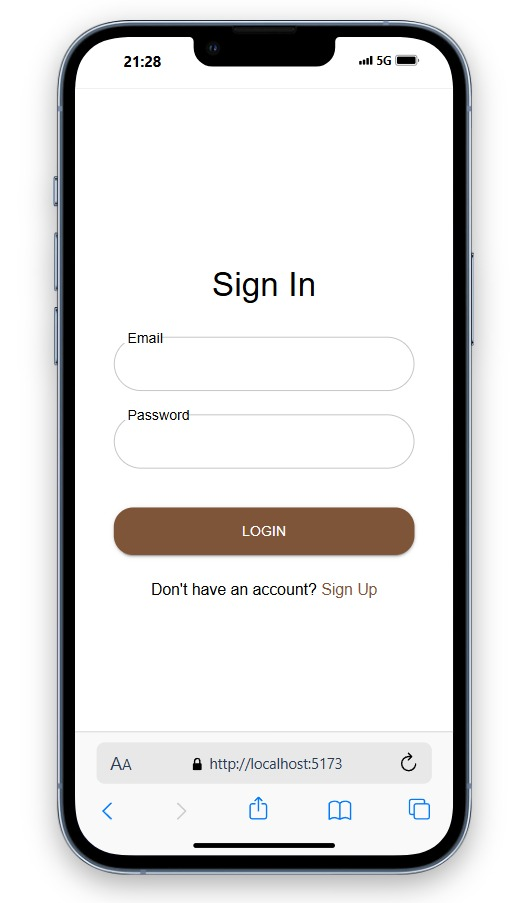
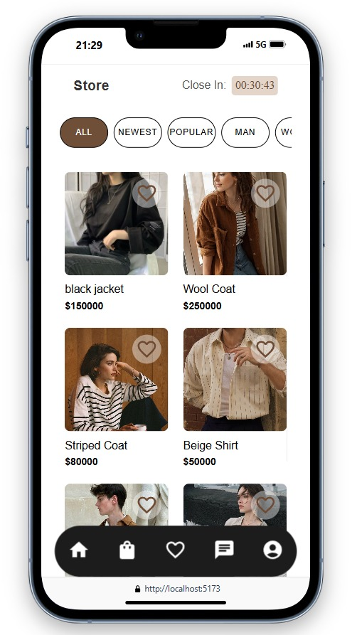
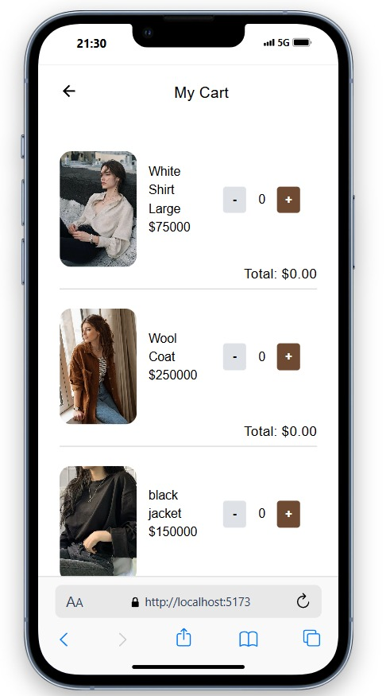
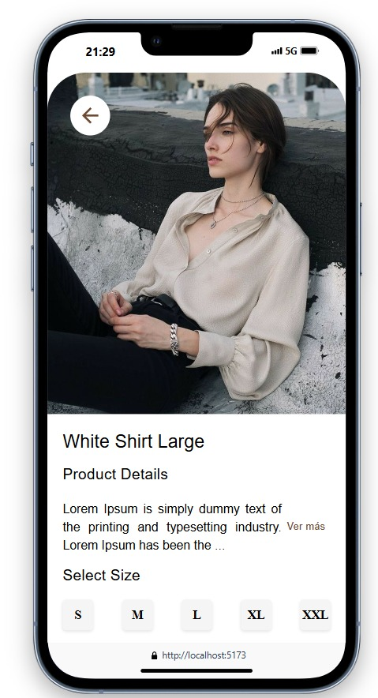

🛍️ MERN Store

🚀 Descripción general

MERN Store es una aplicación de comercio electrónico de pila completa creada con la pila MERN (MongoDB, Express, React y Node.js). El proyecto ofrece funciones como exploración de productos, autenticación de usuarios, funcionalidad de carrito de compras y herramientas de administración para gestionar la tienda.

## 🖼️ Capturas de pantalla

| Página de inicio                                      | Inicio de Sesion                                 |
|-------------------------------------------------------|--------------------------------------------------------|
|              |          |

| Dashboard Principal                               | Detalles de Producto                                     |
|-------------------------------------------------------|--------------------------------------------------------|
|       |             |

| Carrito de compras                              | Detalles de Producto                                     |
|-------------------------------------------------------|--------------------------------------------------------|
|       |             |

---

🛠️ Pila de tecnología

Interfaz: React, Redux, Material UI

Back-end: Node.js, Express.js

Base de datos: MongoDB

Autenticación: tokens web JSON (JWT)

✨ Características

Autenticación de usuario (registro, inicio de sesión, cierre de sesión)

Explorar, buscar y filtrar productos

Carrito de compra con gestión de pedidos

Panel de administración para gestionar productos, usuarios y pedidos

Diseño para móviles 

🚀 Primeros pasos

Prerrequisitos

Node.js y npm instalados

Instancia de MongoDB ejecutándose localmente o en la nube

Instalación

Clonar el repositorio:

intento

Copiar

Editar

clon git https://github.com/StevenLopez009/Tienda-MERN.git 

cd Tienda-MERN 

Instalar dependencias:

intento

Copiar

Editar

# Instalar dependencias del backend  

fuente del cd  

Instalación de npm  

# Instalar dependencias del frontend  

cd ../cliente

Instalación de npm  

Configurar variables de entorno:

Agregue las configuraciones necesarias (URI de MongoDB, secreto JWT, etc.).

Ejecute la aplicación:

intento

Copiar

Editar

# Iniciar backend  

npx src/index.js

# Iniciar frontend  

cd ../cliente 

npm ejecuta dev 

📄 Licencia

Este proyecto está licenciado bajo la licencia MIT.
